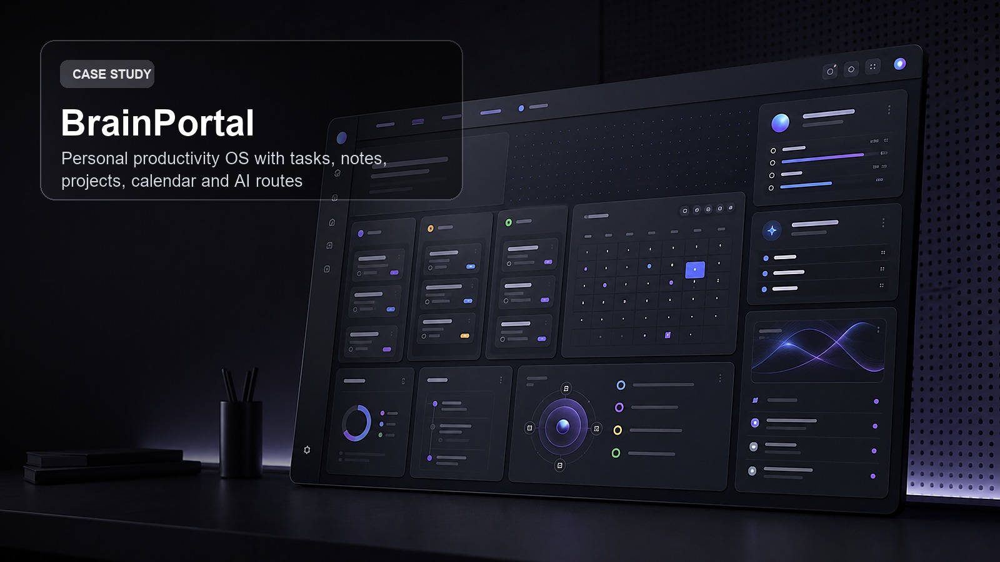
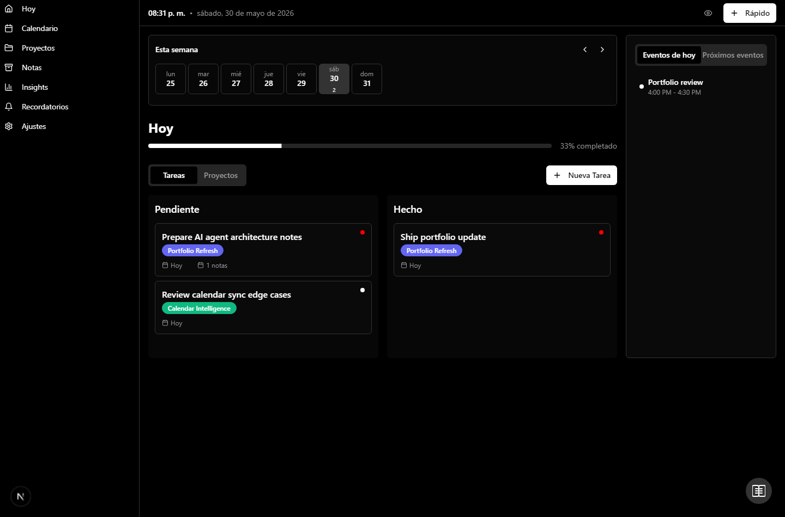

# BrainPortal

BrainPortal is a personal productivity portal built around projects, tasks, notes, calendar views, reminders and AI-assisted coordination. It is designed as a private operating center for planning, capturing context, syncing calendar work and reviewing the day from one workspace.



Portfolio cover generated for presentation. Runtime screenshot:



## Features

- Project and task management with priorities, status and daily metrics.
- Notes connected to projects and tasks.
- Calendar views and Google Calendar integration paths.
- Reminder and event modules.
- AI chat/session routes for summarization and coordination workflows.
- Dashboard views for daily and weekly planning.

## Stack

- Next.js 15
- React 19
- TypeScript
- PostgreSQL / Supabase-oriented schema
- Tailwind CSS
- shadcn/ui and Radix primitives
- OpenAI/OpenRouter-compatible AI routes
- Google Calendar APIs

## Project structure

```text
app/
  api/
  projects/
  reminders/
  calendar/
components/
lib/
  google-auth.ts
  google-calendar-sync.ts
  db.ts
migrations/
```

## Run locally

```bash
npm install
npm run dev
```

The app expects a configured database connection. The canonical schema lives in `database-setup.sql`.

## Key areas

- `components/dashboard.tsx`: main daily dashboard.
- `app/projects`: project and task views.
- `app/calendar`: calendar experience.
- `app/api/*`: server-side data and AI routes.
- `lib/db.ts`: PostgreSQL pool and query helpers.

## Suggested deployment

- Vercel for the Next.js app.
- Supabase or PostgreSQL for the database.
- Google Cloud OAuth credentials for Calendar sync.
- Environment variables managed through the deployment platform.
